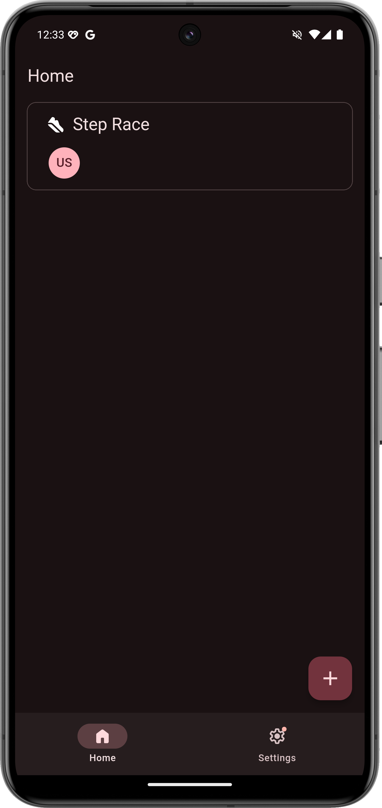
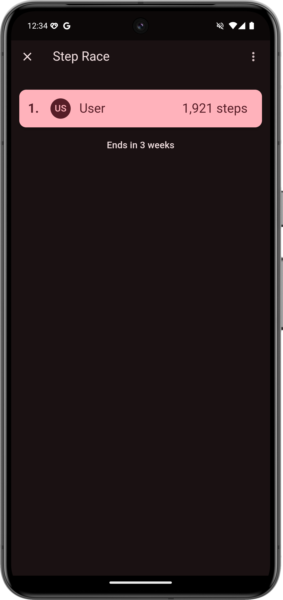
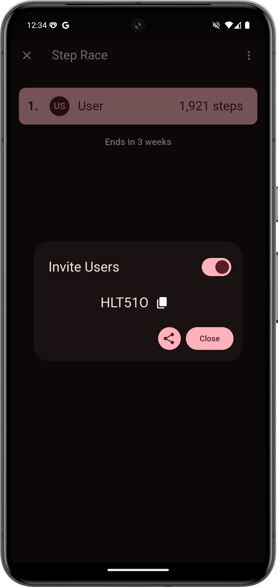
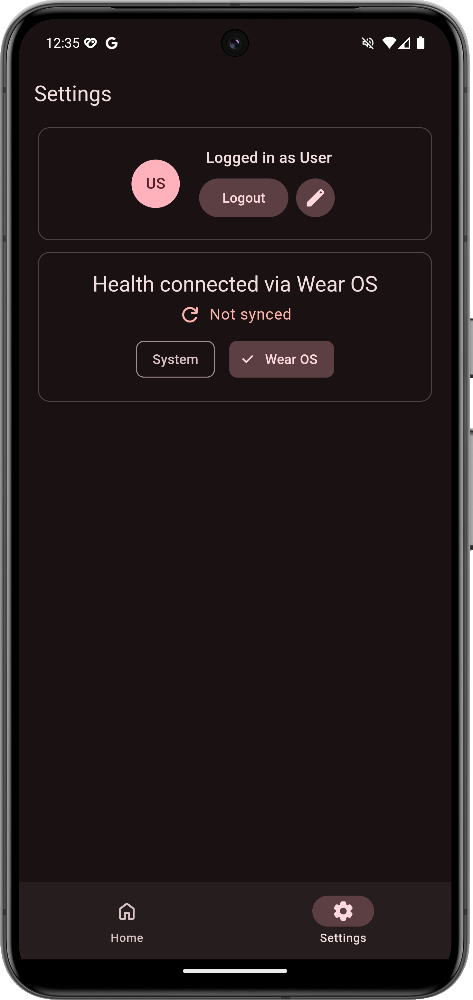

# Fitness Challenges

#### Compete in challenges with friends and family.

### 📸 Preview Images

|                                                                  |                                                                  |                                                                  |                                                                  |
| ---------------------------------------------------------------- | ---------------------------------------------------------------- | ---------------------------------------------------------------- | ---------------------------------------------------------------- |
|  |  |  |  |
| Home                                                             | Step Challenge                                                   | Invite Users                                                     | Health connections and profile                                   |

## 🛠️ Developing

This app is built with [Flutter](https://flutter.dev/), if you don't have flutter setup, flutter has a guide on [how to install and setup flutter on your desktop](https://docs.flutter.dev/get-started/install).

#### 🔍 Tools for developing

- [ ] JDK 21
- [ ] Android Studio
- [ ] Flutter SDK

## ⌚ Wear OS

The app includes a native Wear OS companion app for users to view challenges located in [`/wear-os`](./wear-os).

> [!NOTE]
> The Wear OS app is moving away from syncing health data and towards displaying challenges

> [!WARNING]
> The Wear OS app is currently on pause

### 💻 Creating a Pocketbase instance

See [Pocketbase's documentation](https://pocketbase.io/docs/) to learn how to setup pocketbase locally. All hooks are located in `/pb_hooks`, you will need to add them to your pocketbase instance for developing. [(learn more)](https://pocketbase.io/docs/js-overview/)

If you need to deploy a online instance, you can create a free virtual machine using Oracle and follow [my guide](https://gist.github.com/Turtlepaw/107bf7470c94bed187db5aee6a432f3d) on how to setup pocketbase and deploy it on NGINX with Let's Encrypt.
